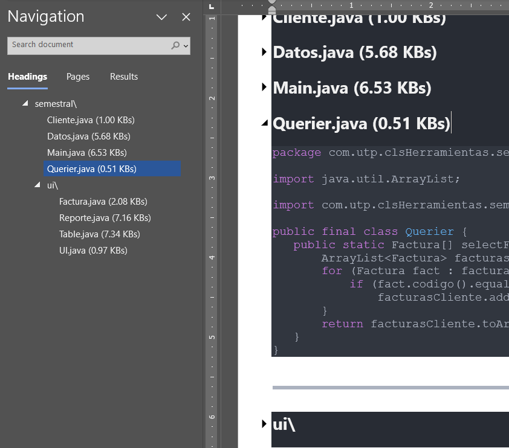

# __**Why?**__

  I had some "Portfolios" I had to submit, optionally as a single word document (Alternatively into a zipped file). In a nutshell, I had to copy and
  paste the relevant (by the time of this writing) `.java` source files into the submit-able document. Pasting VSCode's text was reliably translated
  into formatted Word Text, so I piggybacked from VSCode's `.md` previewer to make a Copy-Paste/able content which could seamlessly get pasted with into
  the word document.

# __**What it does?**__

  Prompts user to select a folder, then reads all the specified `*.fileType` (while recursively going into each sub-folder at "root") inside the selected folder,
  and writes to a `.md` file as `root/root-summary.md`, while providing a Header at X nested-level depending on how many folders were recursively
  searched

# Outro

This so far has allowed me to avoid to manually copy-pasting (while also manually writing out each file's on their proper heading's nest level) at the best, 8 files for a single 
submit-able so far (as of first half of 2024).

The main compelling reason for this was because I wanted to also add headings to the document which allowed me make a navigable through document so I could
use to have a better picture of the document's file structure. And also as a bonus makes it easier to navigate for anyone who's reading the submitable from a word document 
(\*Side glancing at those who requires a document as portfolio*)

